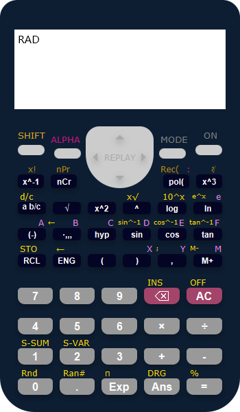

# 科学计算器

## 原项目地址
[Scientific Calculator](https://github.com/OpeyemiOluwa12/ScientificCalculator)
这个大概是为了`clone`下来的人看的，毕竟这是个`fork`下来的项目

## 运行截图

## 我改了啥
- 增添了`Gradle`配置，一键打包`Uber Jar`；
- 修改命名，调整目录结构；
- 尽可能地实现MVC分离，就不同的按钮抽象出方法，方便后续实现目前没有完成的功能（原项目那样的每个按钮复制粘贴一遍太噩梦了）；
- 由于`JavaFX`在字体渲染方面默认的尺寸因平台而异，且缺失逻辑像素的概念，因此这里人为规定字体大小，以期望在不同的环境下都不会有显示溢出或截断的效果；
- 实现窗口可拖动；
- 真正模拟计算器，按下`SHIFT`再按AC即为关闭程序（原项目没有提供关闭程序的功能，只能使用平台相关的强制关闭快捷键/任务管理器/若非`javaw`运行还可按下`Ctrl`+`C`）；
- 主体视图层没有大改，但统一了按钮和标签控件的形式，同时修改了一万个细节，为后续统一使用`fxml`奠定基础；

## 运行
由于本人`Gradle`是个半吊子，`uberJar`的`task`都是官方文档直接抄下来的，也不知道如果本地没有`Gradle`该怎么运行，看了眼`jfoenix`源码发现直接`gradle run`就行了（没有`Gradle`的是`gradlew run`）
~~难为我每次自己构建完了还去从命令行运行`jar`~~

[哈我加了Release](https://github.com/chrysocolla/ScientificCalculator/releases/tag/v0.0-beta.0)

当然了我用的是[Liberica JDK 11 Full](https://bell-sw.com/pages/downloads/#/java-11-lts)，因此自带`OpenJFX`；
要是你没有的话...要不去下一个，要不手动传入`OpenJFX`模块从命令行调用`.\build\libs\calc-uber.jar`？

我个人还蛮喜欢`OpenJDK 11`的，估计要是用`Oracle JDK 8`都没这茬子事儿；

## 缺憾
不使用`fxml`编写出真正MVC的代码简直难到登天，但若要是使用，控件较为密集也未尝就能快速开发；从看`jfoenix`源码的经验来看，似乎要想自定义`JavaFX`组件也无非是继承对应的组件，但就我短浅的目光来看，`fxml`的写法实在是太反直觉了；不知道`fxml`是否能够实现循环渲染，哪怕是编译期的我也举双手双脚赞成；

_也有可能是我Web思维根深蒂固？_

_另：因为我巨懒，且`Java`的`Nashorn`标准支持得太少，所以就连基本的指数都是不能用的（按钮点是能点，但是没法算），另一个原因是我发现用正则去当parser真的是痴人说梦。_
